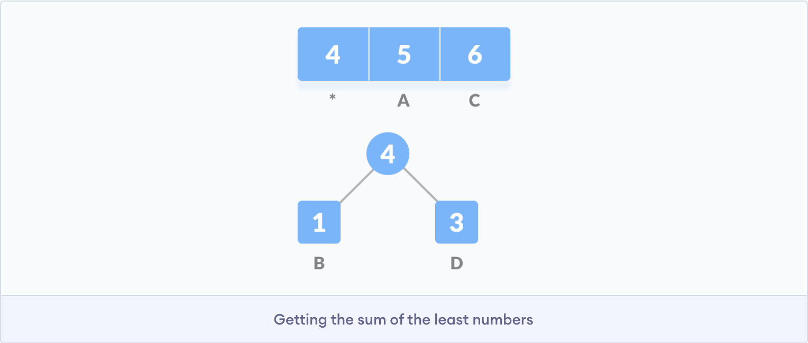
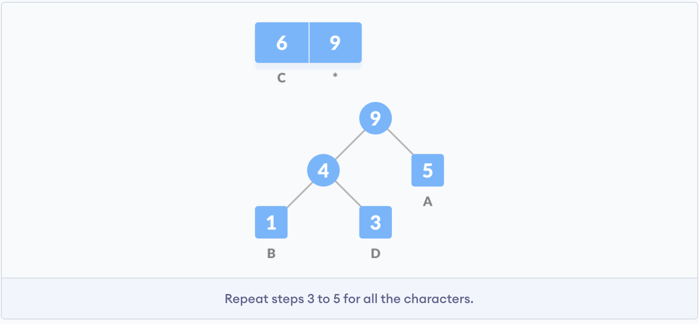
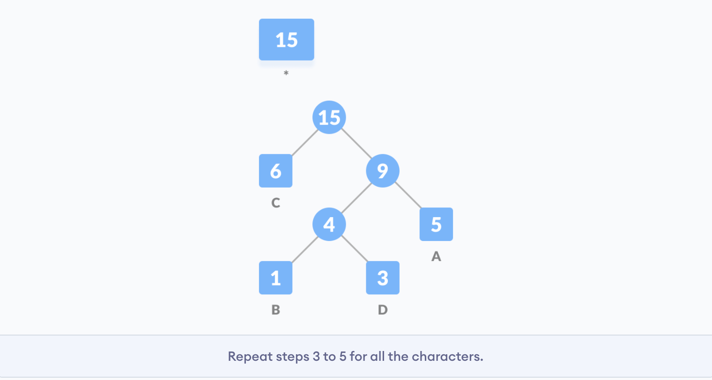
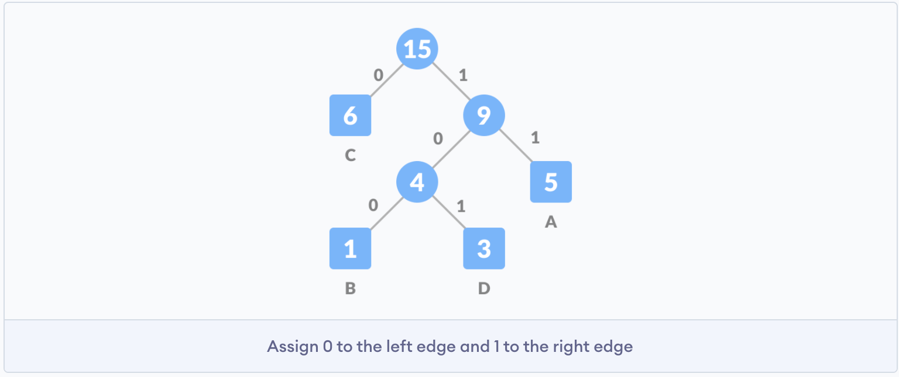
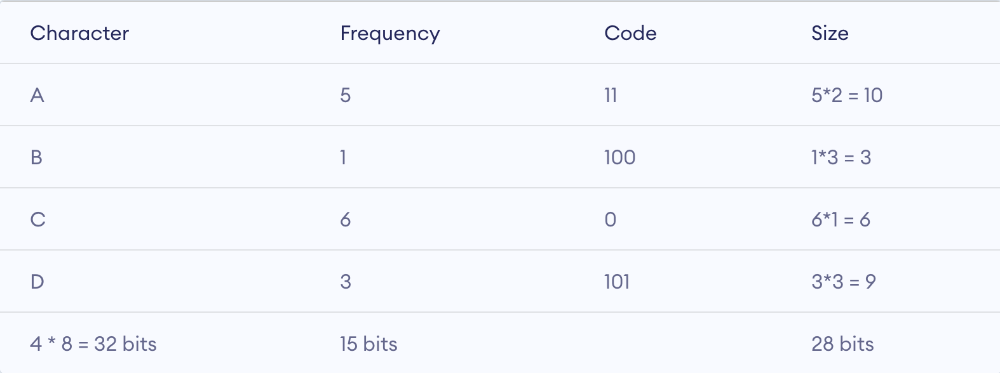

<p align="right">2021-3-5</p>


**霍夫曼编码**（英语：Huffman Coding），又译为**哈夫曼编码**、**赫夫曼编码**，是一种用于[无损数据压缩](https://zh.wikipedia.org/wiki/无损数据压缩)的[熵编码](https://zh.wikipedia.org/wiki/熵编码)（权编码）[算法](https://zh.wikipedia.org/wiki/演算法)。由美国计算机科学家[大卫·霍夫曼](https://zh.wikipedia.org/wiki/大衛·霍夫曼)（David Albert Huffman）在1952年发明。


#### 工作流程

假设需要发送如下字符串到网络中。


每个字符占据 8 bits， 总共 15 个字符， 累计大小是 `8 * 15 = 120` bits。

霍夫曼编码首先根据每个字符出现的频率创建一棵树，然后为每个字符生成编码。

一旦字符串完成了编码， 可以根据同一棵树完成解码。


##### 编码

霍夫曼编码通过如下步骤来实现：

1. 计算字符串中每个字符出现的频率。


2. 对出现的频率进行排序（升序）。结果存储在优先级队列 `Q` 中。


3. 使每一个字符成为 **叶节点**。


4. 创建一个空节点 `z`  。 出现频率最小的当作它的左子树，出现频率第二小的当作它的右子树。将 `z` 的值设置为上述两个出现最小频率的总和




5. 从优先级队列 `Q`  中移除两个出现频率最小的字符，把总和添加到队列中


6. 把节点 `z` 插入到树中。


7. 对所有的字符重复步骤 3 ～ 5。







8. 对每一个非叶节点，将0赋值给左边缘，1赋值给右边缘。




发送上面的字符串到网络中， 需要发送树和上面的压缩编码。总体大小计算如下：




未压缩之前需要发送 `120` bits, 压缩之后体积减少到 `32 + 15 + 28 = 75` bits 。


##### 解码

对于解码操作可以通过根据霍夫曼code值遍历树来找到字符串。

例如解码 101，可以从根节点遍历树直到找到对应的字符。


#### 代码实现

##### python 代码

```python
# coding: utf-8

string = 'BCAADDDCCACACAC'

class NodeTree(object):

    def __init__(self, left=None, right=None):
        self.left = left
        self.right = right

    def children(self):
        return (self.left, self.right)

    def nodes(self):
        return (self, self.right)

    def __str__(self):
        return "%s_%s" % (self.left, self.right)


def huffman_code_tree(node, left=None, binString=''):
    if type(node) is str:
        return {node: binString}
    (l, r) = node.children()
    d = dict()
    d.update(huffman_code_tree(l, True, binString + '0'))
    d.update(huffman_code_tree(r, False, binString + '1'))
    return d


# Calculating frequency
freq = {}
for c in string:
    if c in freq:
        freq[c] += 1
    else:
        freq[c] = 1
freq = sorted(freq.items(), key=lambda x: x[1], reverse=True)
# freq = [('C', 6), ('A', 5), ('D', 3), ('B', 1)]
nodes = freq

while len(nodes) > 1:
    (key1, c1) = nodes[-1]
    (key2, c2) = nodes[-2]
    nodes = nodes[:-2]
    print nodes
    node = NodeTree(key1, key2)
    nodes.append((node, c1 + c2))
    print nodes
    print ""
    nodes = sorted(nodes, key=lambda x: x[1], reverse=True)

root = nodes[0][0]
print root
print type(root.left)
print type(root.right)

huffmanCode = huffman_code_tree(root)
print huffmanCode

print ' Char | Huffman code '
print '---------------------'
for (char, frequency) in freq
:
    print ' %-4r | %12s' % (char, huffmanCode[char])

```


#### 参考

[霍夫曼编码](https://zh.wikipedia.org/wiki/%E9%9C%8D%E5%A4%AB%E6%9B%BC%E7%BC%96%E7%A0%81)

[What is Huffman Coding?](https://www.baseclass.io/huffman-coding/)

[Huffman Coding](https://www.programiz.com/dsa/huffman-coding)