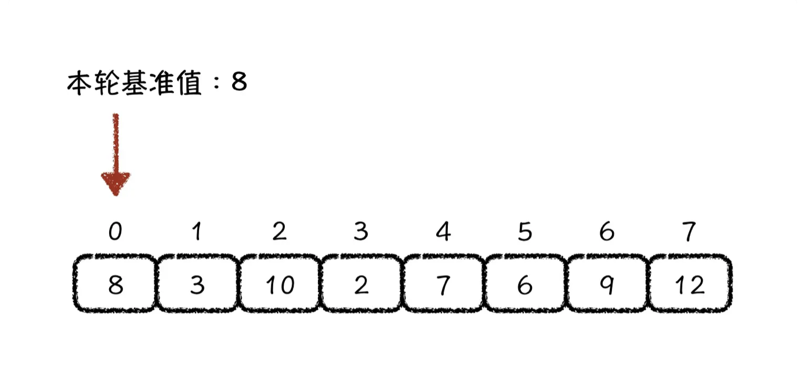
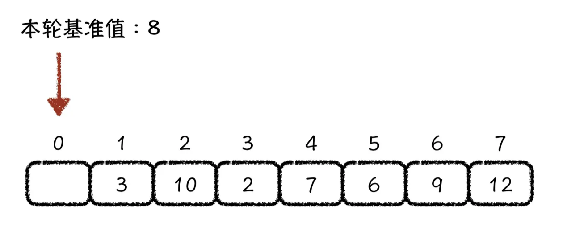
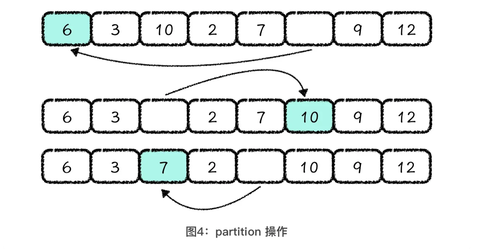
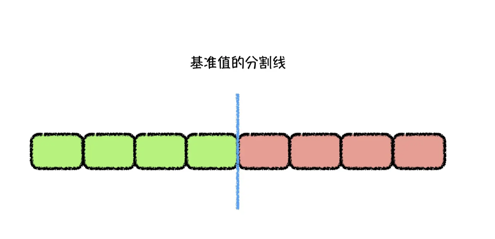
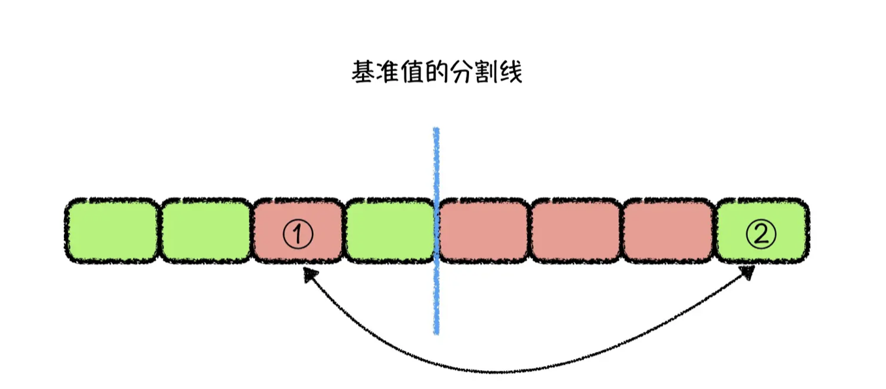

### 算法简介

快速排序使用[分治法](https://zh.wikipedia.org/wiki/分治法)（Divide and conquer）策略来把一个[序列](https://zh.wikipedia.org/wiki/序列)（list）分为较小和较大的2个子序列，然后递归地排序两个子序列。

步骤为：

1. 挑选基准值：从数列中挑出一个元素，称为**基准**(pivo)
2. 分割：重新排序数列，所有比基准值小的元素摆放在基准前面，所有比基准值大的元素摆在基准后面（与基准值相等的数可以到任何一边）。在这个分割结束之后，对基准值的排序就已经完成
3. 递归排序子序列：[递归](https://zh.wikipedia.org/wiki/递归) 地将小于基准值元素的子序列和大于基准值元素的子序列排序。

递归到最底部的判断条件是**数列的大小是零或一**，此时该数列显然已经有序。

选取基准值有多种方法，此选取方法对排序的时间性能有决定性影响。


### 代码实现

#### swift 代码

`swift` 版本 `5`

##### [Lomuto 选择基准值](https://github.com/raywenderlich/swift-algorithm-club/tree/master/Quicksort#lomutos-partitioning-scheme)

###### 代码示例


```swift
static func SortLomuto<T: Comparable>(_ array: inout [T]) -> [T] {
    SortLomuto(&array, 0, array.count - 1)
    return array
}

static private func SortLomuto<T: Comparable>(_ array: inout [T], _ low: Int, _ high: Int) {
    if low < high {
        let p = partitionLomuto(&array, low: low, high: high)
        SortLomuto(&array, low, p - 1)
        SortLomuto(&array, p + 1, high)
    }
}

static private func partitionLomuto<T: Comparable>(_ array: inout [T], low: Int, high: Int) -> Int {
    let pivot = array[high]
    /// 记录基准值的位置，从前往后扫描
    var i = low
    for j in low ..< high {
        if array[j] <= pivot {
            if (i != j) {
                array.swapAt(j, i)
            }
            i += 1
        }
    }
    array.swapAt(i, high)
    return i
}
```


###### Partition 原理

 for 循环把数组分隔成 4 部分：

- [low, i] 包含所有小于或等于基准值的元素
- [i + 1, j - 1] 包含所有大于基准值的元素
- [j, height - 1] 包含尚未遍历到的元素
- [height] 基准值

```
[ values <= pivot | values > pivot | not looked at yet | pivot ]
  low           i   i+1        j-1   j          high-1   high
```


###### Partition 过程举例

假设初始数组是 `8` , `3` , `12` , `7` , `6` , `9` , 初始值 low = 0， high = 5， pivot = 9:

第0次遍历时 `i = j = 0`，`array[j] < array[high]`  且 `i = j`  ,  所以遍历后  `i = j = 1`, 未遍历部分下标为: 1 到 4

```
|8  3|	12	7		6		|9|
low                  high
    i
    j
```

第1次遍历时 `i = j = 1`，`array[j] < array[high]` 且 `i = j` ,  所以遍历后  `i = j = 2`, 未遍历部分下标为: 2 到 4

```
|8  3  12｜	7		6		|9|
low                  high
        i
        j
```

第2次遍历时 `i = j = 2` ，`array[j] > array[high]` ,  所以遍历后  `i = 2,  j = 3` , 未遍历部分下标为: 3 到 4

```
|8  3  12	 7｜		6		|9|
low                  high
        i
           j
```

第3次遍历时 `i = 2, j = 3`，`array[j] < array[high]` ,  且 `i != j` ,  需要交换下标 2 和 3 的位置， 遍历后  `i = 3,  j = 4`, 未遍历部分下标为: 4 到 4

```
|8  3  7	 12	  6｜		|9|
low                    high
           i
                 j
```

第4次遍历时 `i = 3, j = 4`，`array[j] < array[high]` ,  且 `i != j `,  需要交换下标 3 和 4 的位置， 遍历后  `i = 4  j = 5`， 至此全部遍历完成；

```
|8  3  7	 6   12|		|9|
low                   high
                i
                      j
```

最后交换 i 和 high 处元素

```
|8  3  7	 6   9|		  |12|
low                   high
                i
                      j
```

返回 i 下标 4


##### 随机选择基准值

###### 代码示例

```swift
/// 快速排序
///
/// - Parameters:
///   - array: 待排序数组
///   - isReverse: 是否颠倒排序，true 倒序， false 正xu
/// - Returns: 排序之后数组
func quickSort<T: Comparable>(_ array: [T], _ isReverse: Bool) -> [T] {
    guard array.count > 1 else { return array }

    var left = [T]()
    var right = [T]()
    var middle = [T]()
  	// 随机选择基准值
    let pivot = array.randomElement()!
    for item in array {
        if item == pivot {
            middle.append(item)
        } else if item < pivot {
            left.append(item)
        } else {
            right.append(item)
        }
    }
    if isReverse {
        return quickSort(right, isReverse) + middle + quickSort(left, isReverse)
    }
    return quickSort(left, isReverse) + middle + quickSort(right, isReverse)
}
```


###### Partition 原理

1. 任意选择一个元素当作基准值


##### 双指针选择基准值值

###### 代码示例

```swift
static func Sort<T: Comparable>(_ array: inout [T]) -> [T] {
    partitionLeftRight(&array, low: 0, high: array.count - 1)
    return array
}

static private func partitionLeftRight<T: Comparable>(_ array: inout [T], low: Int, high: Int) {
    guard high >= low else {
        return
    }

    var left = low  /// 记录从前往后的扫描位置
    var right = high /// 记录从后往前的扫描位置
    let pivot = array[left] /// 基准值，选择待排序区间的第一个元素
    /// 每一轮, 先从后往前扫，再从前往后扫
    while left < right {
        while (left < right && array[right] >= pivot) {
            right -= 1
        }
        if left < right {
            /// 后面扫描完毕，接着从前开始扫描
            array[left] = array[right]
            left += 1
        }
        while (left < right && array[left] <= pivot) {
            left += 1
        }
        if left < right {
            /// 前面扫描完毕，接着从后开始扫描
            array[right] = array[left]
            right -= 1
        }
    }
  	/// 将基准值放入数组的left位置， 此时left和right相等
    array[left] = pivot

    partitionLeftRight(&array, low: low, high: left - 1)
    partitionLeftRight(&array, low: left + 1, high: high)
}
```


###### Partition 原理

简答理解：**空出一个位置，反复地前后掉换元素**。

当我们选择了基准值以后，原先基准值的位置就相当于被空出来了，也就是说数组的第一位是空着的；

我们借助这个空位，将后面小于基准值的元素放到前面的空位上，这样后面就空出一位了；

然后，我们再将前面大于基准值的元素放到后面这个空位上；

就这样交替进行，直到空位前面的值都小于基准值，空位后面的值都大于基准值为止。


###### Partition 过程举例







###### 优化

- 减少函数调用次数

  **单边递归优化**的方式，就是当本层完成了 partition 操作以后，让本层继续完成基准值左边的 partition 操作，而基准值右边的排序工作交给下一层递归函数去处理。

  ```python
  def quickSort(array):
      quickSortLeftAndRight1(array, 0, len(array) - 1)
  
  
  def quickSortLeftAndRight1(array, low, high):
      while low < high:
          index = partition(array, low, high)
          # 右侧正常调用递归函数
          quickSortLeftAndRight1(array, index + 1, high)
          # 用本层处理左侧的排序
          high = index - 1
  
  def partition(array, left, right):
      pivot = array[left]
      while left < right:
          while left < right and array[right] >= pivot:
              right -= 1
          if left < right:
              array[left] = array[right]
              left += 1
          while left < right and array[left] < pivot:
              left += 1
          if left < right:
              array[right] = array[left]
              right -= 1
      array[left] = pivot
      return left
  ```

  

- 基准值选取优化

  **三点取中法**，就是每一轮取排序区间的头、尾和中间元素这三个值，然后把它们排序以后的中间值作为本轮的基准值。

- partition操作优化

partition实现过程: 先**从后向前**找**小于基准值**的数字放到前面，再**从前向后**找**大于基准值**的数字放到后面，直到首尾指针相遇为止。

其实，想要比较容易地理解这个过程，我们可以假设基准值的位置是数组中间的一条分割线，小于基准值的都是绿色元素，大于基准值的都是红色元素。如下图所示




这个时候，你可以想一想，在什么情况下，我们才需要将基准值后面的元素调换到前面？

**一定是因为这个分割线后面有绿色的元素**。而且基准值的客观位置不变，红色与绿色元素数量是确定的，所以**存在多少个绿色元素在基准值位置的后面，就一定存在多少个红色元素在基准值位置的前面**。




那 partition 操作的目的，就是要把**基准值位置后面的绿色元素调整到前面，将基准值位置前面的红色元素调整到后面**。 也就是交换上图中 1、2 号元素的位置。既然需要调换的红色与绿色元素的数量相同，我们就可以**让头指针向后查找红色元素，尾指针向前查找绿色元素，然后交换头尾指针所指向的元素**，重复这个过程，直到头尾指针**交错**后停止。

这就是对 partition 操作进行的优化。

  ```python
  def selectValue(array, left, right):
      mid = (left + right) / 2
      if array[left] > array[mid]:
          array[left], array[mid] = array[mid], array[left]
      if array[left] > array[right]:
          array[left], array[right] = array[right], array[left]
      if array[mid] > array[right]:
          array[mid], array[right] = array[right], array[mid]
      return array[mid]
  
  def quickSort(array, left, right):
      while left < right:
          x = left
          y = right
          z = selectValue(array, left, right)
          while x <= y:
              while array[x] < z:
                  x += 1
              while array[y] > z:
                  y -= 1
              if x <= y:
                  array[x], array[y] = array[y], array[x]
                  x += 1
                  y -= 1
          quickSort(array, x, right)
          right = y
  ```

  


#### Python 代码

```python
def quick_sort(array):
    partition(array, 0, len(array) - 1)
    return array

def partition(array, low, high):
    """
    array: 待排序数组， range: [low, high]
    low:   待排序数组起始坐标
    high:  待排序数组结束坐标
    """

    if (low >= high):
        return
    l = low # 记录从前往后的扫描位置
    r = high # 记录从后往前的扫描位置
    pivot = array[l] # 基准值，选择待排序区间的第一个元素
    # 每一轮, 先从后往前扫，在从前往后扫
    while (l < r):
        while (l < r and array[r] >= pivot):
            r -= 1
        if (l < r):
            array[l] = array[r]
            l += 1
        while (l < r and array[l] <= pivot):
            l += 1
        if (l < r):
            array[r] = array[l]
            r -= 1
    
    # 将基准值放入数组的l位
    array[l] = pivot
    print l, array
    partition(array, low, l - 1)
    partition(array, l + 1, high)

def quick_sort_lomuto(array):
    partitionLomuto(array, 0, len(array) - 1)
    return array

def partitionLomuto(array, low, high):
    if low >= high:
        return
    index = low
    pivot = array[high]
    for j in range(low, high):
        if array[j] <= pivot:
            if (j != index):
                array[j] , array[index] = (array[index], array[j])
            index += 1
    (array[index], array[high]) = (array[high], array[index])
    partitionLomuto(array, low, index - 1)
    partitionLomuto(array, index + 1, high)

```


### 性能

最坏时间复杂度: O( n<sup>2</sup> )

最优时间复杂度: O( n * log<sub>n</sub> )

平均时间复杂度: O( n * log<sub>n</sub> )


空间复杂度: 根据实现方式的不同而不同

### 参考

[维基百科](https://zh.wikipedia.org/wiki/快速排序)

[swift-algorithm-club](https://github.com/raywenderlich/swift-algorithm-club/tree/master/Quicksort)

[快速排序](https://www.runoob.com/w3cnote/quick-sort-2.html)

[快排优化](https://time.geekbang.org/column/article/274591)

