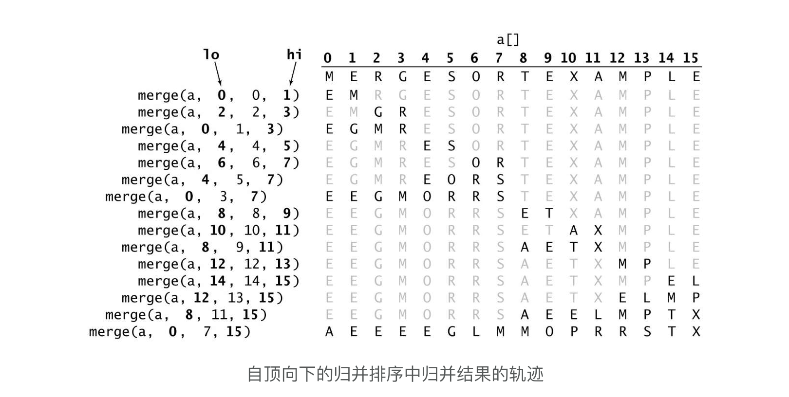
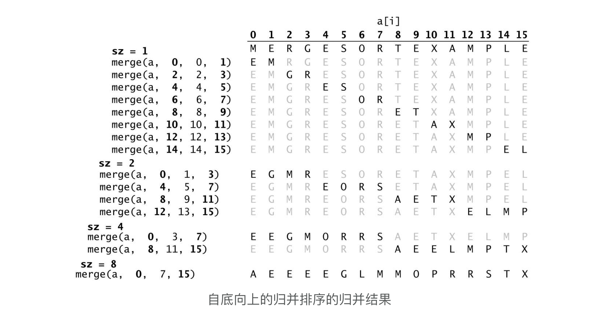

### 算法简介

Merge Sort 由 [John von Neumann](https://en.wikipedia.org/wiki/John_von_Neumann) 在 1945 年发明的，主要采用 `分而治之` 的方法来排序。 主要有两种实现方式:

- 自顶向下的递归

- 自底向上的迭代

#### 自顶向下的实现方式

##### 算法步骤

1. 把一个无序数组分割成 2 个子数组；
2. 每个子数组重复步骤1，直到子数组都分割成只有 1 个元素的数组（认为该数组有序）；
3. 将 2 个包含 1 个元素的有序数组，合并成 1 个包含 2 个元素的大数组；
4. 将 2 个包含 2 个元素的有序数组，合并成 1 个包含 4 个元素的大数组；
5. 依次类推可以把所有的元素合并成一个新的有序数组；

##### 动图演示


##### 代码实现

###### swift

```swift
static public func SortUpToDown<T: Comparable>(array: inout [T], _ orderCriteria:(T, T) -> Bool) -> [T] {
    guard array.count > 1 else {
        return array
    }
    Sort(array: &array, low: 0, high: array.count - 1, orderCriteria: orderCriteria)
    return array
}

static private func Sort<T: Comparable>(array: inout [T], low: Int, high: Int, orderCriteria:(T, T) -> Bool) {
    guard high > low else {
        return
    }

    let mid = low + (high - low)/2 // 避免溢出
    Sort(array: &array, low: low, high: mid, orderCriteria: orderCriteria)
    Sort(array: &array, low: mid + 1, high: high, orderCriteria: orderCriteria)
    Merge(array: &array, low: low, mid: mid, high: high, orderCriteria: orderCriteria)
}
    
/// 原地归并的抽象方法
static private func Merge<T: Comparable>(array: inout [T], low: Int, mid: Int, high: Int, orderCriteria: (T, T) -> Bool) {
    var left = low
    var right = mid + 1
    var aux = [T]()
    for k in 0 ... high {
        aux.append(array[k])
    }
    for k in low ... high {
        if (left > mid) { // 左半部分元素取完
            array[k] = aux[right]
            right += 1
        } else if (right > high) { // 右半部分元素取完
            array[k] = aux[left]
            left += 1
        } else if orderCriteria(aux[right], aux[left]) {
            array[k] = aux[right]
            right += 1
        } else {
            array[k] = aux[left]
            left += 1
        }
    }
}
```


##### 性能

平均时间复杂度: O(n log n)

空间复杂度： O(n)


#### 自底向上的实现方式

##### 算法步骤

1. 每 2 个相邻的 1 个元素进行排序(此时每 2 个元素是有序的)；
2. 每 2 个相邻的 2 个元素进行排序(此时每 4 个元素是有序的)；
3. 每 2 个相邻的 4 个元素进行排序(此时每 8 个元素是有序的)；
4. 依次类推直到所有的元素都排序完成；

##### 动图演示

##### 


##### 代码实现

##### swift

```swift
static func SortBottomToUp<T>(_ array: [T], _ orderCriteria: (T, T) -> Bool) -> [T] 
{
    let n = array.count

    /// 1. 双缓存：分配一个临时工作数组，同时避免每次合并的时候重新分配内存；
    /// 使用2个数组，分别用来读写操作；
    /// 变量 d 来控制读写位置
    var z = [array, array]
    var d = 0

    /// 2. 待合并的数组宽度 1, 2, 4, 8, ...
    var width = 1
    while width < n {
        var writeArray = z[1 - d]
        let readArray = z[d]
        /// 3. 每次待合并的小数组的起始位置
        var begin = 0
        while begin < n {

            /// 当前处理的位置
            var index = begin
            /// 左边数组起始位置
            var left = begin
            /// 右侧数组起始位置
            var right = left + width

            let lmax = min(left + width, n)
            let rmax = min(right + width, n)

            while left < lmax && right < rmax {
                if orderCriteria(readArray[left], readArray[right]) {
                    writeArray[index] = readArray[left]
                    left += 1
                } else {
                    writeArray[index] = readArray[right]
                    right += 1
                }
                index += 1
            }
            /// 右侧处理完毕，处理左侧数组
            while left < lmax {
                writeArray[index] = readArray[left]
                index += 1
                left += 1
            }
            /// 左侧数组处理完毕， 处理右侧数组
            while right < rmax {
                writeArray[index] = readArray[right]
                index += 1
                right += 1
            }

            /// 相邻数组处理完毕，移动到下一对小数组
            begin += width*2
        }
        /// 增加数组合并范围
        width *= 2

        /// 切换辅助数组读写位置
        z[1-d] = writeArray
        d = 1 - d
    }
    return z[d]
}
```


#### Python

```python
def merge_sort(array):
    merge_up_to_down(array, 0, len(array) - 1)
    return array

def merge_up_to_down(array, low, high):
    if (high <= low):
        return
    mid = low + (high - low) / 2
    merge_up_to_down(array, low, mid)
    merge_up_to_down(array, mid + 1, high)
    merge(array, low, mid, high)

def merge_down_to_up(array):
    size = 1
    while size < len(array):
        end = len(array) - size
        low = 0
        while low < end:
            high = min(low + size + size - 1, len(array) - 1)
            mid = (low + size) - 1
            merge(array, low, mid, high)
            low += size + size
        size += size
    return array

def merge(array, low, mid, high):
    left = low
    right = mid + 1
    # 拷贝high个元素
    aux = array[0 : high + 1]
    for i in range(low, high + 1):
        if left > mid: #左边元素处理完毕，添加右边元素
            array[i] = aux[right]
            right += 1
        elif right > high: # 右边元素处理完毕，添加左边元素
            array[i] = aux[left]
            left += 1
        elif aux[left] > aux[right]:
            array[i] = aux[right]
            right += 1
        else:
            array[i] = aux[left]
            left += 1
```

##### `merge` 调用顺序示意图:


`自顶向下合并顺序`



自低向上合并顺序




### 参考链接

- [十大经典排序算法](https://github.com/hustcc/JS-Sorting-Algorithm)
- [归并排序](https://www.cnblogs.com/nullzx/p/5968170.html)
- [swift-algorithm-club](https://github.com/raywenderlich/swift-algorithm-club/tree/master/Merge%20Sort)
- [维基百科](https://en.wikipedia.org/wiki/Merge_sort) 
