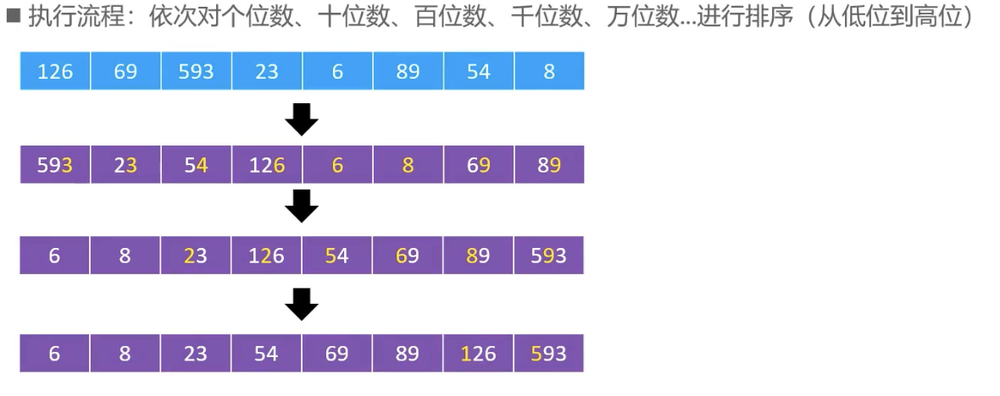

**基数排序**（英语：Radix sort）是一种非比较型 [整数](https://zh.wikipedia.org/wiki/整数)[排序算法](https://zh.wikipedia.org/wiki/排序算法)，其原理是将整数按位数切割成不同的数字，然后按每个位数分别比较。


#### 图画演示




#### 代码实现

##### Swift

```swift
static func Sort(_ array: inout [Int]) -> [Int] {
    guard array.count > 0 else {
        return array
    }
    var max = array[0]
    for element in array {
        if element > max {
            max = element
        }
    }
    var diviler = 1
    while diviler <= max {
        countingSort(diviler, &array)
        diviler *= 10
    }
    return array
}

static func countingSort(_ diviler: Int, _ array: inout [Int]) {
    // initialized the countsArray
    var countsArray = [Int](repeating: 0, count: 10)
    // caculate counts value
    for element in array {
        let index = element / diviler % 10
        countsArray[index] += 1
    }
    // sum all the counts
    for i in 1 ..< countsArray.count {
        countsArray[i] += countsArray[i - 1]
    }

    var newArray = [Int](repeating: 0, count: array.count)
    var i = array.count - 1
    while i >= 0 {
        let index = array[i] / diviler % 10
        countsArray[index] -= 1
        newArray[countsArray[index]] = array[i]
        i -= 1
    }

    for i in 0..<array.count
    {
        array[i] = newArray[i]
    }
}
```


##### Python

```python
def radix_sort(array):
    max = array[0]
    for element in array:
        if element > max:
            max = element
    
    divider = 1
    while divider <= max:
        array = _counting_sort(divider, array)
        divider *= 10
    return array

def _counting_sort(divider, array):
    # inititalized counts array
    countsArray = []
    for _ in range(0, 10):
        countsArray.append(0)
    
    for element in array:
        # caculate radix
        # 598 / 1 % 10 = 8
        # 598 / 10 % 10 = 9
        # 598 / 100 % 10 = 5
        index = element / divider % 10
        countsArray[index] += 1
    
    # sum the counts
    for i in range(1, len(countsArray)):
        countsArray[i] += countsArray[i - 1]

    newArray = []
    for _ in range(0, len(array)):
        newArray.append(0)

    i = len(array) - 1
    while i >= 0:
        index = array[i] / divider % 10
        countsArray[index] -= 1
        newArray[countsArray[index]]= array[i]
        i -= 1

    for index in range(0, len(array)):
        array[index] = newArray[index]
    return array
```


#### 参考

[基数排序](https://zh.wikipedia.org/wiki/基数排序)