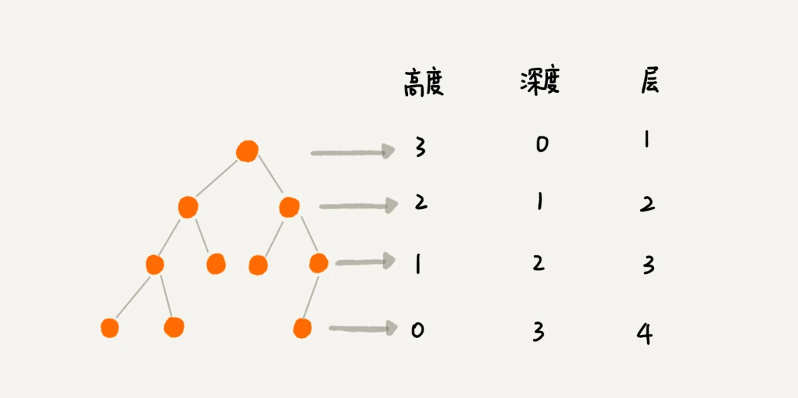
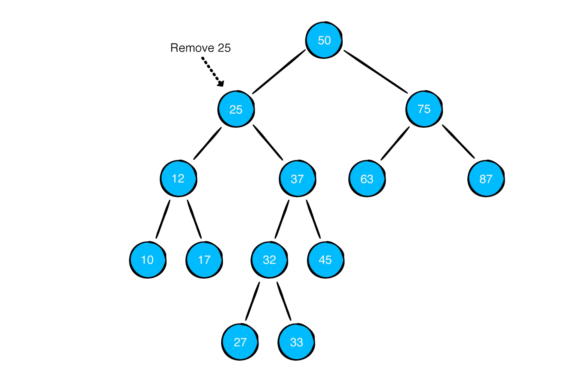
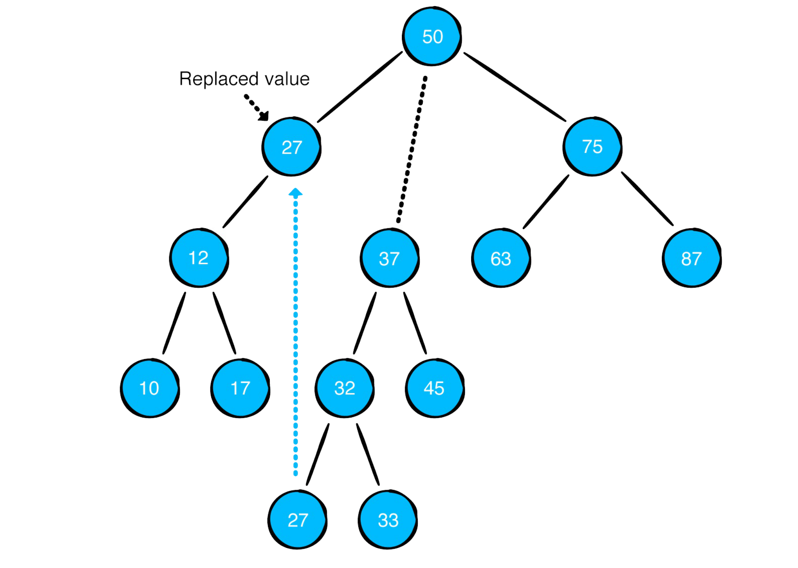
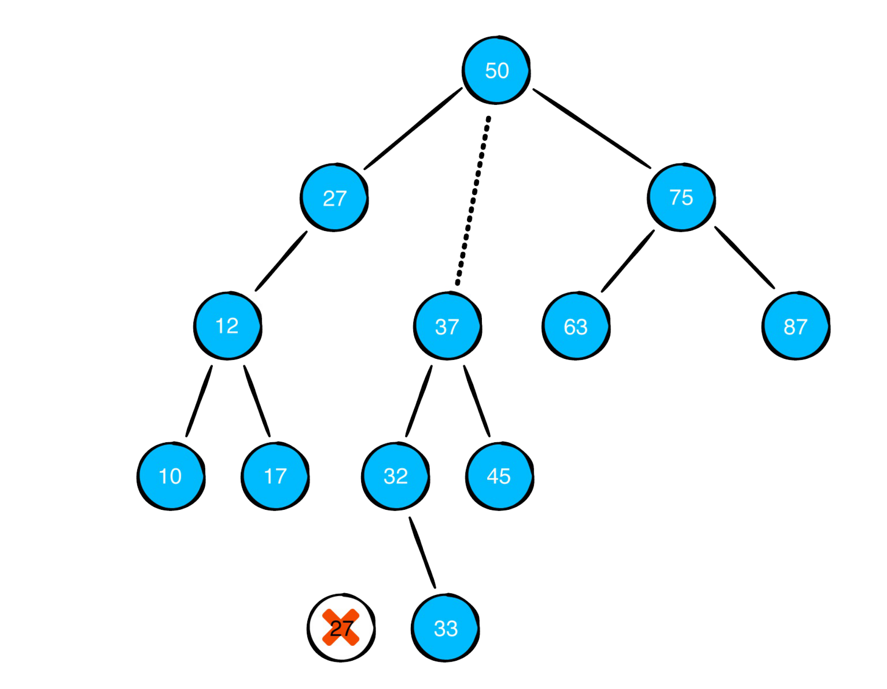
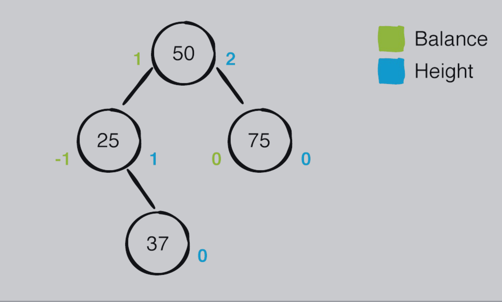
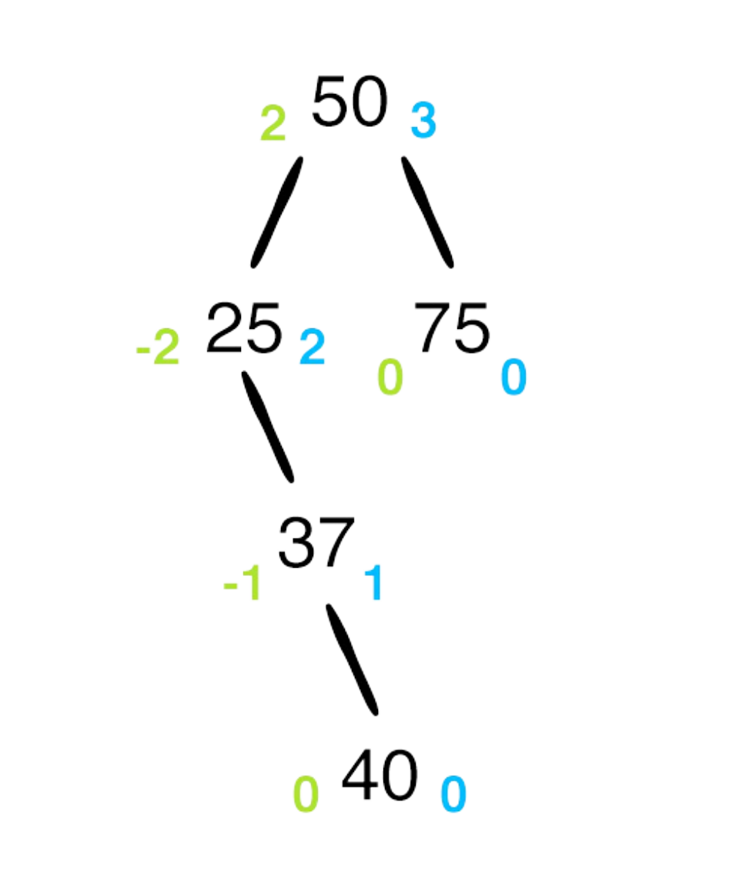
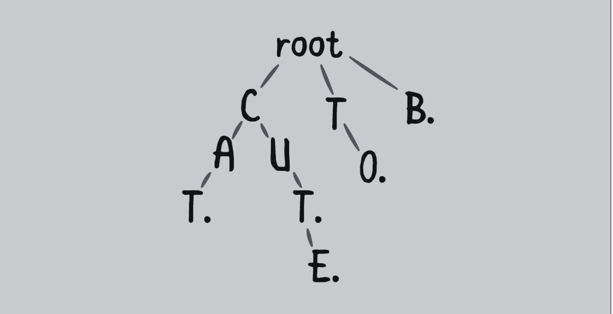

# 树


## 基本概念

**树**（英语：tree）是一种 **抽象数据类型** 或是实现这种抽象数据类型的 **数据结构** ，用来模拟具 **有树状结构性质** 的数据集合。

它是由n（n>0）个有限节点组成一个具有层次关系的**集合**。

把它叫做“树”是因为它看起来像一棵倒挂的树，也就是说它是根朝上，而叶朝下的。

它具有以下的特点：

- 每个节点都只有有限个子节点或无子节点；
- 没有父节点的节点称为根节点；
- 每一个非根节点有且只有一个父节点；
- 除了根节点外，每个子节点可以分为多个不相交的子树；
- 树里面没有环路(cycle)


**高度(Height)** : 节点到叶子节点的最长路径（边数）

**深度(Depth)** : 根节点到这个节点所经历的边的个数

**层数(Level)** : 节点的深度 + 1

**树的高度**: 根节点的高度




- 前序遍历：对于树中的任意节点，先打印这个节点，然后再打印它的左子树，最后打印它的右子树。
- 中序遍历：对于树中的任意节点，先打印它的左子树，然后再打印它本身，最后打印它的右子树。
- 后序遍历： 对于树中的任意节点，先打印它的左子树，然后再打印它的右子树，最后打印它本身。


## 树的种类

- 无序树：树中任意节点的子节点之间没有顺序关系，这种树称为无序树，也称为[自由树](https://zh.wikipedia.org/wiki/自由树)；

- 有序树：树中任意节点的子节点之间有顺序关系，这种树称为有序树；

  - 二叉树：每个节点最多含有两个子树的树称为二叉树；
    - 完全二叉树：对于一棵二叉树，假设其深度为d（d>1）。除了第d层外，其它各层的节点数目均已达最大值，且第d层所有节点从左向右连续地紧密排列，这样的二叉树被称为完全二叉树；
      - [满二叉树](https://zh.wikipedia.org/wiki/满二叉树)：所有叶节点都在最底层的完全二叉树；
    - [平衡二叉树](https://zh.wikipedia.org/wiki/平衡二叉树)（[AVL树](https://zh.wikipedia.org/wiki/AVL树)）：当且仅当任何节点的两棵子树的高度差不大于1的二叉树；
    - [排序二叉树](https://zh.wikipedia.org/wiki/排序二元樹)([二叉查找树](https://zh.wikipedia.org/wiki/二叉查找树)（英语：Binary Search Tree))：也称二叉搜索树、有序二叉树；
  - [霍夫曼树](https://zh.wikipedia.org/wiki/霍夫曼树)：[带权路径](https://zh.wikipedia.org/w/index.php?title=带权路径&action=edit&redlink=1)最短的二叉树称为哈夫曼树或最优二叉树；
  - [B树](https://zh.wikipedia.org/wiki/B树)：一种对读写操作进行优化的自平衡的二叉查找树，能够保持数据有序，拥有多于两个子树。

  

### 二叉树

每个节点最多含有两个子树的树称为二叉树；

#### 代码实现

```swift
public class BinaryNode<Element> {
    public var value: Element
    public var leftChild: BinaryNode?
    public var rightChild: BinaryNode?
    
    public init(value: Element) {
        self.value = value
    }
}

extension BinaryNode {
    /// 中序遍历
    ///
    /// In-order traversal visit the nodes of a binary tree in the following order, starting from the root node
    /// - If the current node has a left child, recursively visit this child first
    /// - Then visit the node itself
    /// - If the current node has a right child, recursively visit this child
    public func traverseInOrder(visit: (Element) -> Void) {
        leftChild?.traverseInOrder(visit: visit)
        visit(value)
        rightChild?.traverseInOrder(visit: visit)
    }
    
    /// 前置遍历
    ///
    /// Pre-order traversal always visits the current node first, then recursively visit the left and right child
    public func traversePreOrder(visit: (Element) -> Void) {
        visit(value)
        leftChild?.traversePreOrder(visit: visit)
        rightChild?.traversePreOrder(visit: visit)
    }
    
    /// 后置遍历
    ///
    /// Post-order traversal only visits the current node after the left and right child have been visited recursively.
    public func traversePostOrder(visit: (Element) -> Void) {
        leftChild?.traversePostOrder(visit: visit)
        rightChild?.traversePostOrder(visit: visit)
        visit(value)
    }
}
```


### 二叉搜索树(Binary Search Tree)

二叉搜索树满足下面2种基本原则:

- 左子树的值小于它父节点的值
- 右子树的值大于或等于它父节点的值


#### 代码实现

```swift
public class BinarySearchTree<Element: Comparable> {
    public private(set) var root: BinaryNode<Element>?
    
    public init() {}
}

extension BinarySearchTree: CustomStringConvertible {
    public var description: String {
        return root?.description ?? "empty tree"
    }
}


extension BinarySearchTree {
    public func insert(_ value: Element) {
        root = insert(from: root, value: value)
    }
    
    private func insert(from node: BinaryNode<Element>?, value: Element) -> BinaryNode<Element>? {
        guard let node = node else {
            return BinaryNode(value: value)
        }
        if value < node.value {
            node.leftChild = insert(from: node.leftChild, value: value)
        } else {
            node.rightChild = insert(from: node.rightChild, value: value)
        }
        return node
    }
}

extension BinarySearchTree {
    /// O(log n)
    public func contains(_ value: Element) -> Bool {
        var current = root
        while let node = current {
            if node.value == value {
                return true
            }
            if value < node.value {
                current = node.leftChild
            } else {
                current = node.rightChild
            }
        }
        return false
    }
}

private extension BinaryNode {
    var min: BinaryNode {
        return leftChild?.min ?? self
    }
}

extension BinarySearchTree {
    public func remove(_ value: Element) {
        root = remove(node: root, value: value)
    }
    
    private func remove(node: BinaryNode<Element>?, value: Element) -> BinaryNode<Element>? {
        guard let node = node else {
            return nil
        }
        
        if value == node.value {
            /// 1. 叶节点，直接删除
            if node.leftChild == nil && node.rightChild == nil {
                return nil
            }
            
            /// 2. 单个子节点
            if node.leftChild == nil {
                return node.rightChild
            }
            if node.rightChild == nil {
                return node.leftChild
            }
            
            /// 3. 当前节点有2个子节点
            /// 找到该节点的右子树中最小的值，把当前节点的值替换为右子树中最小的值
            /// 删除右子树最小值
            node.value = node.rightChild!.min.value
            node.rightChild = remove(node: node.rightChild, value: node.value)
        } else if value < node.value {
            node.leftChild = remove(node: node.leftChild, value: value)
        } else {
            node.rightChild = remove(node: node.rightChild, value: value)
        }
        return node
    }
}
```


删除操作： 删除有2个子节点的节点




找到右子树中最小值，然后替换




删除右子树中最小值



### AVL 树

二叉树中任意一个节点的左右子树的高度相差不能大于1。


#### 代码实现

```swift
public class AVLNode<Element> {
    
    public var value: Element
    public var leftChild: AVLNode?
    public var rightChild: AVLNode?
    public var height = 0
    
    public init(value: Element) {
        self.value = value
    }
    public var balanceFactor: Int {
        return leftHeight - rightHeight
    }
    public var leftHeight: Int {
        return leftChild?.height ?? -1
    }
    public var rightHeight: Int {
        return rightChild?.height ?? -1
    }
}

extension AVLNode {
    var min: AVLNode {
        return leftChild?.min ?? self
    }
}

public class AVLTree<Element: Comparable> {
    
    public private(set) var root: AVLNode<Element>?
    
    /**  左旋示意图
        25作为待旋转节点
         50                        50
        /  \                      /  \
       25   65     ====>         37  65
         \                      /  \
         37                    25  40
          \
          40
     */
    private func leftRotate(_ node: AVLNode<Element>) -> AVLNode<Element> {
        /// 选择待旋转节点的右节点作为中枢点
        /// 该中枢点将代替待旋转的节点作为整个子树的根节点
        let pivot = node.rightChild!
        
        /// pivot节点的左节点（如果存在）的值比node节点的值大，作为node节点的右节点
        node.rightChild = pivot.leftChild
        
        /// node节点作为pivot节点的左节点
        pivot.leftChild = node
        
        /// 更新 pivot 和 node 节点的高度
        node.height = max(node.leftHeight, node.rightHeight) + 1
        pivot.height = max(pivot.leftHeight, pivot.rightHeight) + 1
        
        /// 返回 pivot 节点
        return pivot
    }
    
    /** 右旋示意图
            10                  7
           /  \               /   \
          7   12    ===>     4     10
         / \                / \    / \
        4   8              1   5  8  12
       / \
      1   5
     */
    private func rightRotate(_ node: AVLNode<Element>) -> AVLNode<Element> {
        let pivot = node.leftChild!
        node.leftChild = pivot.rightChild
        pivot.rightChild = node
        node.height = max(node.leftHeight, node.rightHeight) + 1
        pivot.height = max(pivot.leftHeight, pivot.rightHeight) + 1
        return pivot
    }
    
    /** right-left 示意图
        
               50                      50                    50
              /  \                    /  \                  /  \
             25  55    =====>        25  55     =====>     36  55
               \                      \                   /  \
               37                     36                 25   37
              /                        \
             36                         37
                                      37右旋               25左旋
     */
    private func rightLeftRotate(_ node: AVLNode<Element>) -> AVLNode<Element> {
        guard let rightChild = node.rightChild else {
            return node
        }
        node.rightChild = rightRotate(rightChild)
        return leftRotate(node)
    }
    
    /** left-right 示意图
     
              50                      50                    50
             /  \                    /  \                  /  \
            25  55    =====>        25  55    =====>      15  55
           /                        /                    /  \
          10                       15                   10   25
           \                      /
           15                    10
                                 10节点左旋              25节点右旋
     */
    private func leftRightRotate(_ node: AVLNode<Element>) -> AVLNode<Element> {
        guard let leftChild = node.leftChild else {
            return node
        }
        node.leftChild = leftRotate(leftChild)
        return rightRotate(node)
    }
    
    private func balanced(_ node: AVLNode<Element>) -> AVLNode<Element> {
        switch node.balanceFactor {
            case 2:
                if let leftChild = node.leftChild, leftChild.balanceFactor == -1 {
                    return leftRightRotate(node)
                } else {
                    return rightRotate(node)
                }
            case -2:
                if let rightChild = node.rightChild, rightChild.balanceFactor == 1 {
                    return rightLeftRotate(node)
                } else {
                    return leftRotate(node)
                }
            default:
                return node
        }
    }
}

// MARK: - Insert

extension AVLTree {
    public func insrt(_ value: Element) {
        root = insert(from: root, value: value)
    }
    
    private func insert(from node: AVLNode<Element>?, value: Element) -> AVLNode<Element> {
        guard let node = node else {
            return AVLNode(value: value)
        }
        if value < node.value {
            node.leftChild = insert(from: node.leftChild, value: value)
        } else {
            node.rightChild = insert(from: node.rightChild, value: value)
        }
        let balancedNode = balanced(node)
        balancedNode.height = max(balancedNode.leftHeight, balancedNode.rightHeight) + 1
        return balancedNode
    } 
}

// MARK: - Remove

extension AVLTree {
    public func remove(_ value: Element) {
        root = remove(from: root, value: value)
    }
    
    private func remove(from node: AVLNode<Element>?, value: Element) -> AVLNode<Element>? {
        guard let node = node else {
            return nil
        }
        
        if value == node.value {
            /// 1. 叶节点，直接删除
            if node.leftChild == nil && node.rightChild == nil {
                return nil
            }
            
            /// 2. 单个子节点
            if node.leftChild == nil {
                return node.rightChild
            }
            if node.rightChild == nil {
                return node.leftChild
            }
            
            /// 3. 当前节点有2个子节点
            /// 找到该节点的右子树中最小的值，把当前节点的值替换为右子树中最小的值
            /// 删除右子树最小值
            node.value = node.rightChild!.min.value
            node.rightChild = remove(from: node.rightChild, value: node.value)
        } else if value < node.value {
            node.leftChild = remove(from: node.leftChild, value: value)
        } else {
            node.rightChild = remove(from: node.rightChild, value: value)
        }
        
        let balancedNode = balanced(node)
        balancedNode.height = max(balancedNode.leftHeight, balancedNode.rightHeight) + 1
        return balancedNode
    }
}

// MARK: - Contain

extension AVLTree {
    public func contain(_ value: Element) -> Bool {
        var current = root
        while let node = current {
            if value == node.value {
                return true
            } else if value < node.value {
                current = node.leftChild
            } else {
                current = node.rightChild
            }
        }
        return false
    }
}

// MARK: - Debug

extension AVLTree: CustomStringConvertible {
    public var description: String {
        return root?.description ?? "empty tree"
    }
}

```


AVL 平衡因子计算方式： 左子树高度 - 右子树高度




非平衡二叉树的节点的平衡因子为 -2 或者 2



### Trie 树

**trie**，又称**前缀树**或**字典树**，是一种有序树，用于保存关联数组，其中的键通常是字符串。

与二叉查找树不同，键不是直接保存在节点中，而是由节点在树中的位置决定。

一个节点的所有子孙都有相同的前缀，也就是这个节点对应的字符串，而根节点对应空字符串。

一般情况下，不是所有的节点都有对应的值，只有叶子节点和部分内部节点所对应的键才有相关的值。

trie 类似下图所示:




#### 代码实现

```swift
public class TrieNode<Key: Hashable> {
    public var key: Key?
    public weak var parent: TrieNode?
    public var children: [Key: TrieNode] = [:]
    public var isTerminating = false
    
    public init(key: Key?, parent: TrieNode?) {
        self.key = key
        self.parent = parent
    }
}

public class Trie<CollectionType: Collection> where CollectionType.Element: Hashable {
    
    public typealias Node = TrieNode<CollectionType.Element>
    
    private let root = Node(key: nil, parent: nil)
    
    public init() { }
}

extension Trie {
    public func insert(_ collection: CollectionType) {
        var current = root
        for element in collection {
            if current.children[element] == nil {
                current.children[element] = Node(key: element, parent: current)
            }
            current = current.children[element]!
        }
        current.isTerminating = true
    }
    
    public func contains(_ collection: CollectionType) -> Bool {
        var current = root
        for element in collection {
            guard let child = current.children[element] else {
                return false
            }
            current = child
        }
        return current.isTerminating
    }
    
    public func remove(_ collection: CollectionType) {
        /// 判断 trie 中是否包含 collection
        /// 把 curren 指向 collection 中最后一个点
        var current = root
        for element in collection {
            guard let child = current.children[element] else {
                return
            }
            current = child
        }
        
        guard current.isTerminating else {
            return
        }
        /// 设置终止标识符，确保下面步骤可以移除
        current.isTerminating = false
        
        /// 避免删除共享数据, 确保删除的节点是终止节点
        /// 从最后一个节点依次往上删除
        while let parent = current.parent, current.children.isEmpty && !current.isTerminating {
            parent.children[current.key!] = nil
            current = parent
        }
    }
}

public extension Trie where CollectionType: RangeReplaceableCollection {
    func collections(startingWith prefix: CollectionType) -> [CollectionType] {
        var current = root
        for element in prefix {
            guard let child = current.children[element] else {
                return []
            }
            /// curren 指向 prefix 的末尾位置
            current = child
        }
        /// 递归检查 curren 之后的节点
        return collections(startingWith: prefix, after: current)
    }
    
    private func collections(startingWith prefix: CollectionType, after node: Node) -> [CollectionType] {
        var result: [CollectionType] = []
        
        /// curren 如果是 terminal 节点， 添加进入结果集中
        if node.isTerminating {
            result.append(prefix)
        }
        
        /// 遍历 curren 子节点
        for child in node.children.values {
            /// 更新 prefix
            var newPrefix = prefix
            newPrefix.append(child.key!)
            
            /// 递归调用，检查子节点是否符合 更新后的 prefix
            result.append(contentsOf: collections(startingWith: newPrefix, after: child))
        }
        return result
    }
}
```


## 参考资料

[树](https://zh.wikipedia.org/wiki/%E6%A0%91_(%E6%95%B0%E6%8D%AE%E7%BB%93%E6%9E%84))

[Trie 树](https://zh.wikipedia.org/wiki/Trie)

[数据结构与算法之美](https://time.geekbang.org/column/article/67856)

